# Lab4Web

### Nama        : Panji Putra Pamungkas
### Nim         : 311910587
### Kelas       : TI. 19. B1
### Mata Kuliah : Pemograman Web - Tugas 4

#### 1. Membuat HTML lab4_box.html dengan CSS pada head.
Coding
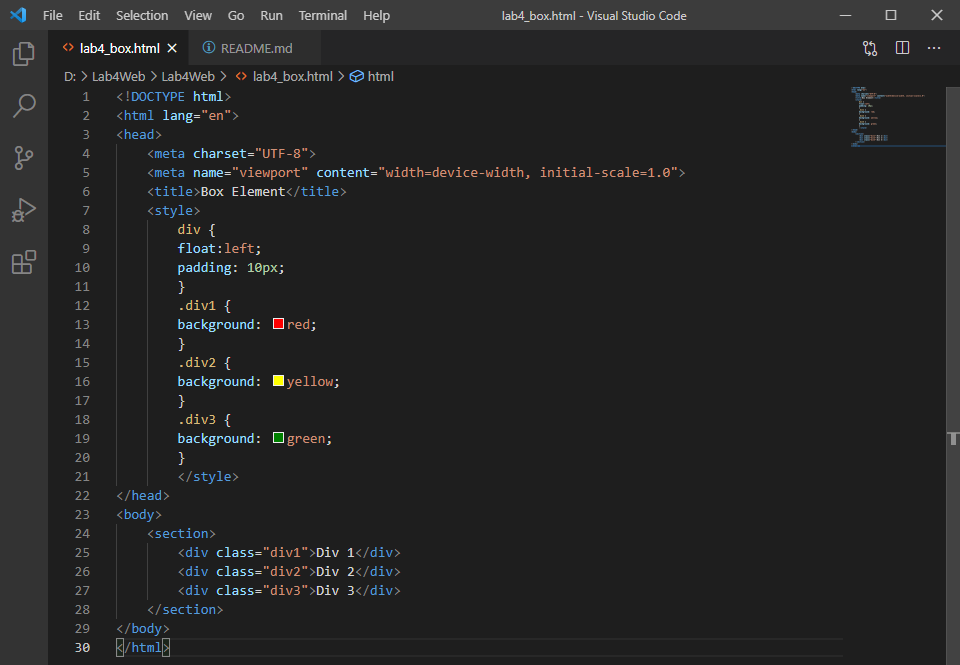
Tampilan pada web
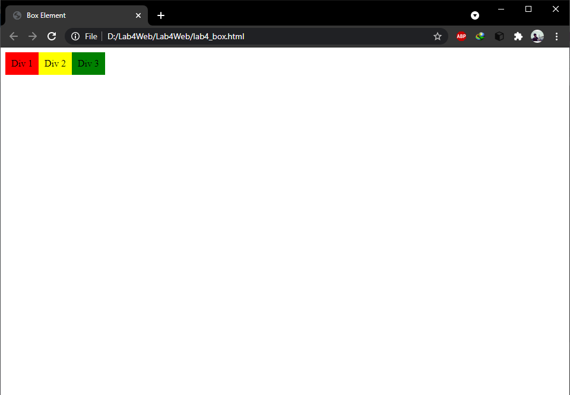

#### 2. Mengatur Clearfix Element
Coding
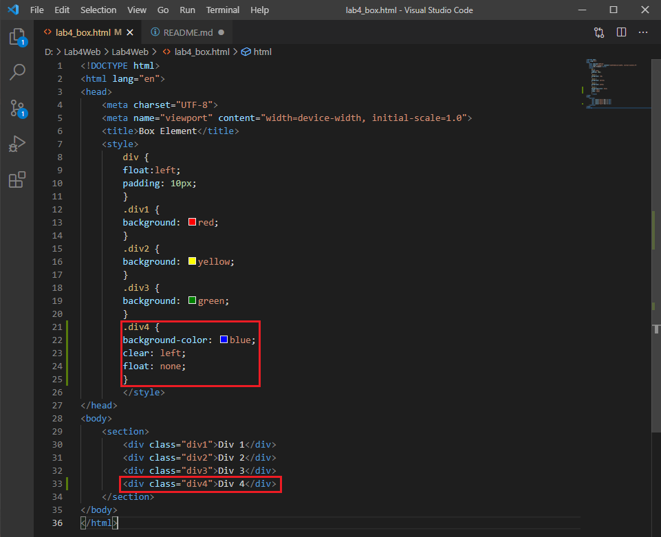
Tampilan pada web
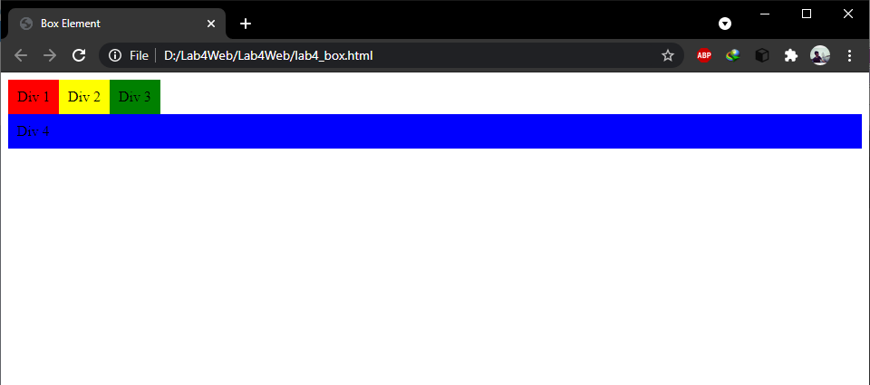
Tampilan apabila menggunakan properti clear dengan nilai right.
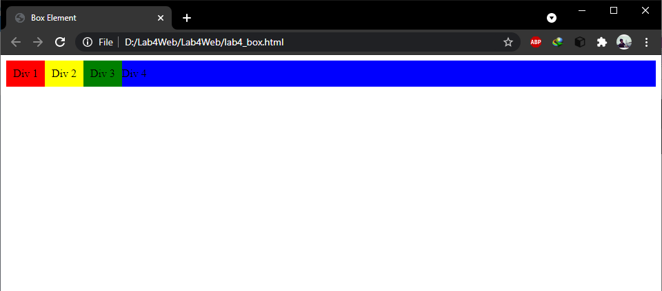

### Membuat Layout Sederhana

#### 1. Membuat home.html pada folder baru dengan nama lab4_layout

Coding pada home.html 
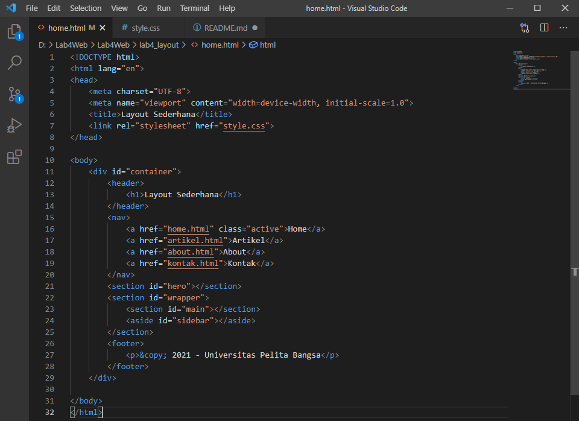
Tampilan pada web
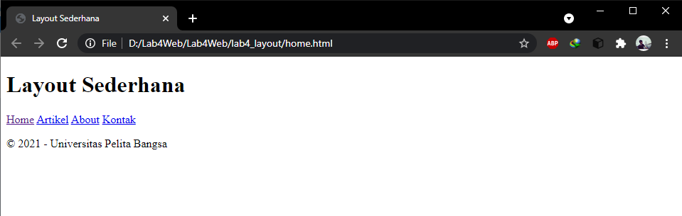

#### 2. Membuat style.css pada folder baru dengan nama lab4_layout

Coding pada style.css
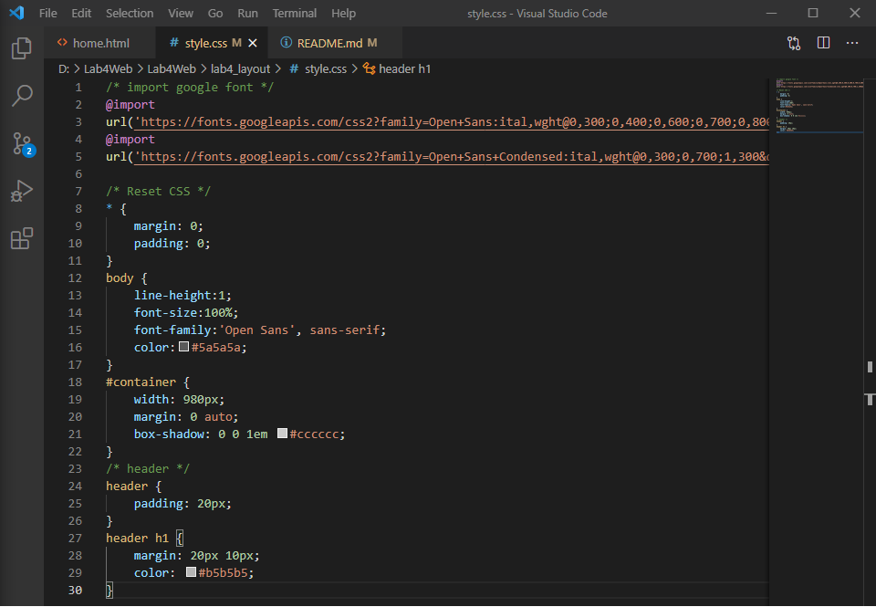
Tampilan pada web
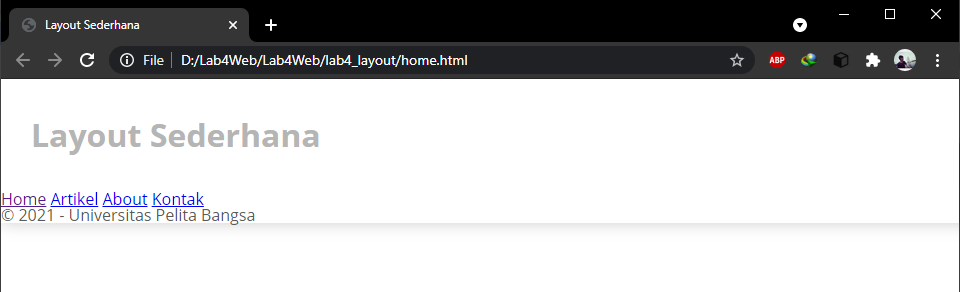

##### 3. Membuat code untuk navigasi pada style.css

Coding pada style.css
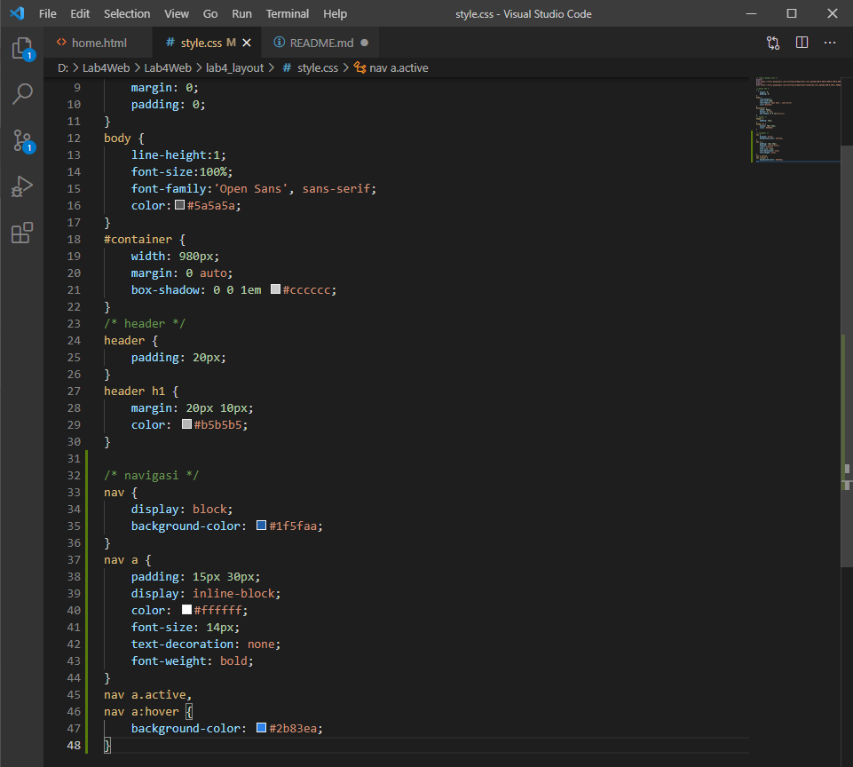
Tampilan pada web
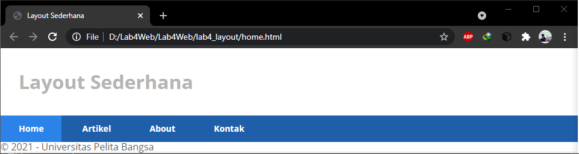

##### 4. Membuat code untuk hero panel pada home.html dan style.css

Coding pada home.html
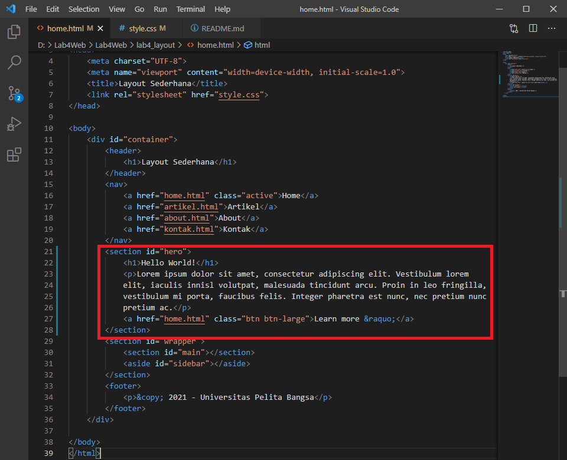
Coding pada style.css
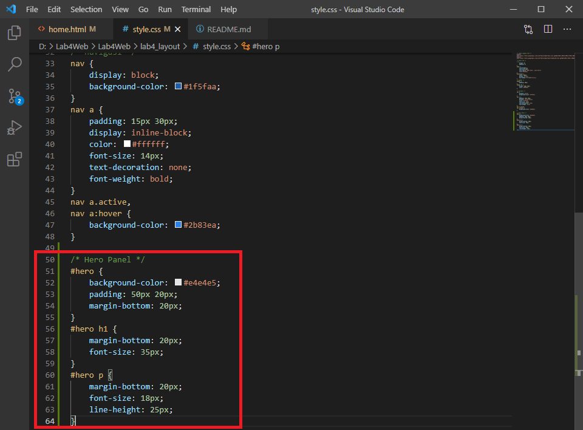
Tampilan pada web
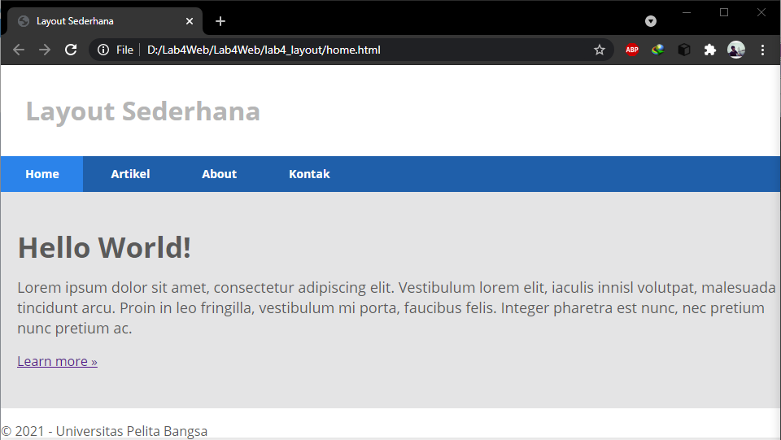